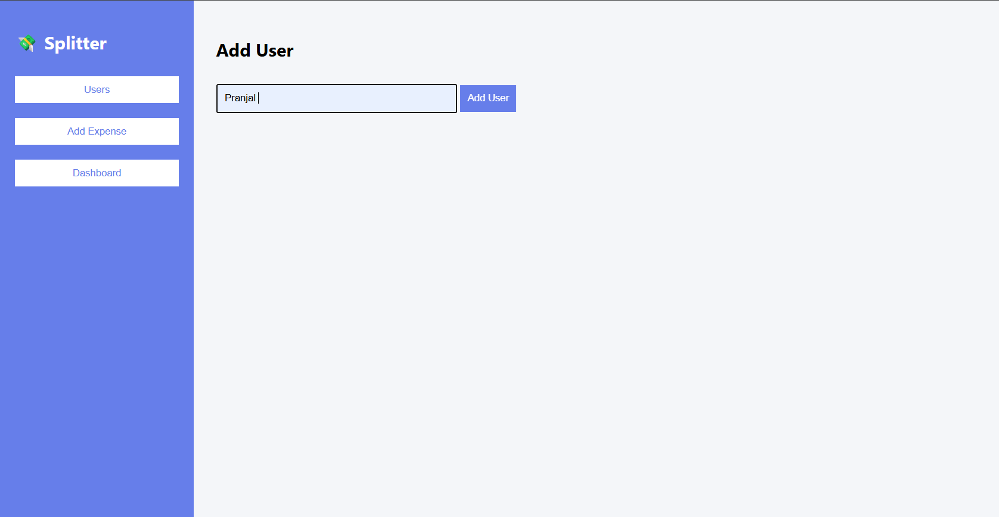
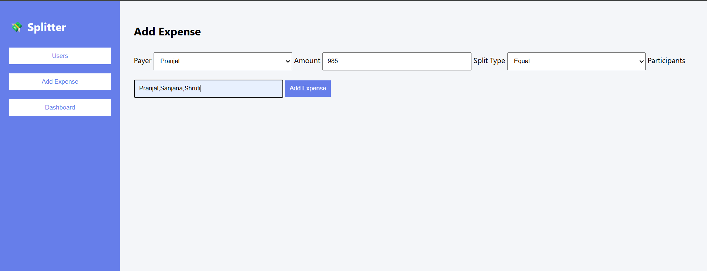
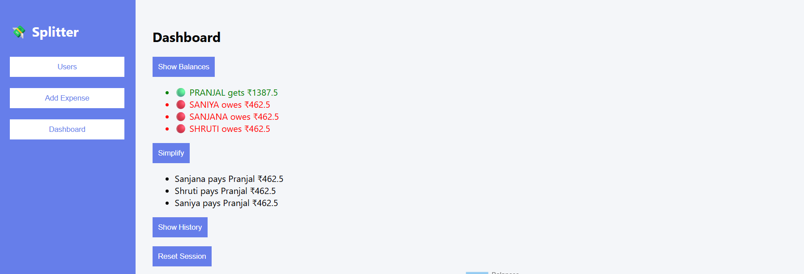
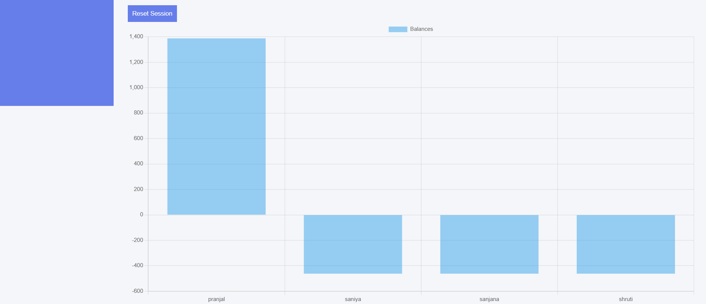

# 💸 Advanced Expense Splitting Engine

## 📌 Overview
The Advanced Expense Splitting Engine is a full-stack web application designed to simplify group expense management. It allows multiple users to record shared expenses and automatically calculates the most efficient way to settle debts.

The system models expenses using a graph-based approach and applies optimization techniques to reduce the number of transactions required to settle balances.

---

## 🚀 What the Project Does

- 👥 Allows users to add participants in a group  
- 💰 Records expenses with one or multiple contributors (via multiple entries)  
- ⚖️ Supports both **equal split** and **custom split** of expenses  
- 🧠 Calculates net balances for each user  
- 🔄 Uses a **greedy algorithm** to minimize the number of transactions  
- 📊 Displays balances and visualizes them using graphs  
- 🧾 Maintains **expense history** for previous sessions  
- 🔁 Provides a **reset feature** to start a new session without losing history  

---

## 🧠 Core Concept

The application uses:
- **Graph-based modeling** → Users as nodes, transactions as edges  
- **Greedy optimization** → Minimizes number of payments  
- **Debt network simplification** → Converts multiple debts into fewer transactions  

---

## 🎯 Example

If multiple users owe money to each other, instead of many payments, the system simplifies it into the minimum number of transactions required to settle all balances.

---

## 🏆 Outcome

This project demonstrates:
- Efficient algorithm design  
- Real-world financial problem solving  
- Full-stack development skills  
- Clean and user-friendly UI implementation  

## Features
- Equal & Custom Split
- Graph-based debt simplification
- Greedy optimization algorithm
- Expense history
- Reset session
- Interactive dashboard

## Tech Stack
- Frontend: HTML, CSS, JavaScript
- Backend: Flask (Python)
- Database: SQLite

## How to Run

### Backend
cd backend
python app.py

### Frontend
Open index.html in browser

## 📸 Screenshots

### 👥 Users Page

### 💰 Expense Page

### 📊 Dashboard

### 📈 Graph
